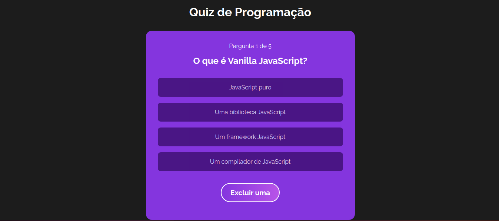

<h1 align="center"> Quiz de Programação</h1>

<p align="center">
  <a href="#-tecnologias">Tecnologias</a>&nbsp;&nbsp;&nbsp;|&nbsp;&nbsp;&nbsp;
  <a href="#-projeto">Projeto</a>&nbsp;&nbsp;&nbsp;|&nbsp;&nbsp;&nbsp;
  <a href="#-deploy">Deploy</a>&nbsp;&nbsp;&nbsp;|&nbsp;&nbsp;&nbsp;
  <a href="#memo-licença">Licença</a>
</p>

<p align="center">
  
</p>

<br>

<p align="center">
  
</p>

## 🚀 Tecnologias

Esse projeto foi desenvolvido com as seguintes tecnologias:

- React.Js
- ContextApi
- CSS

## Instalação do projeto localmente

Para instalar o projeto localmente, você precisa ter o Node.js e o npm instalados na sua máquina. Em seguida, siga os passos abaixo:

- Clone o repositório do GitHub:

```bash
git clone https://github.com/Rodrigo-Monteiro-Lima/quiz-react.git
```
Entre na pasta do projeto com o comando 

```javascript
cd quiz-react
```

Instale as dependências com o comando

```javascript
 npm install
```

Inicie o servidor local com o comando

```javascript
 npm start
```

Abra o navegador e acesse o endereço http://localhost:3000

## 💻 Projeto

Quiz de Programação é um projeto que consiste em um jogo de perguntas e respostas sobre HTML, CSS e Javascript, desenvolvido com React.js.Exibição de uma pergunta aleatória sobre o tema escolhido, com quatro alternativas de resposta.Feedback visual para acerto da resposta. Exibição da pontuação final ao término do jogo, com a possibilidade de jogar novamente ou escolher outro tema.


## 🔖 Deploy

Acesse esse site por: [Vercel](https://quiz-react-gules.vercel.app/)


## :memo: Licença

Esse projeto está sob a licença MIT.

---
